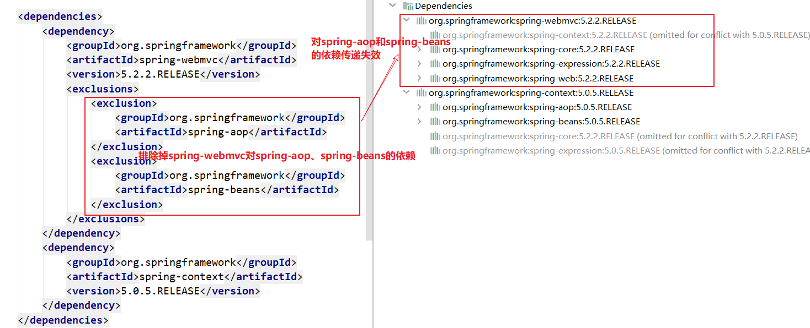
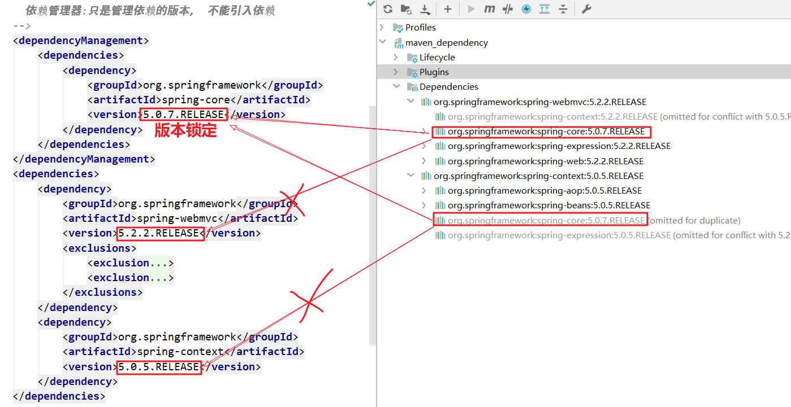
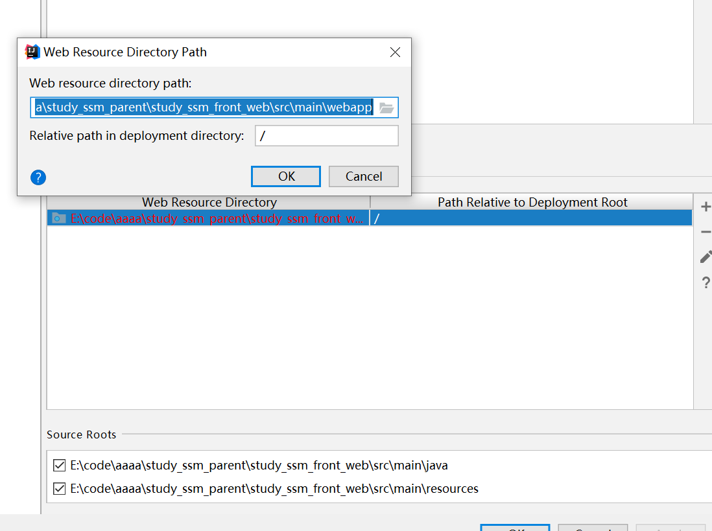

# Maven高级

### 今日目标

1. Maven基础知识复习
2. **理解依赖传递的冲突和解决方法**
3. **理解继承和聚合的作用**
4. **掌握拆分和聚合SSM框架[重点]**

## 一、maven基础复习

```
1. maven的作用（优点）
	依赖管理: 统一管理jar包（管理三方库），自动从maven仓库中去下载到工程中
	项目构建(一步构建)：把编码完成后的过程标准化（编译、打包、安装、部署等），用命令来完成
  适合大型项目的开发：分模块构建项目（把复杂的项目分为多个模块进行管理）
2. 仓库的分类
	 本地仓库: 本机电脑上
	 远程仓库：不在本机
	 		私服: 一般搭建在公司内部的局域网上
	 		中央仓库:  maven 团队维护的中央仓库
	 		（官方仓库：国外，下载速度慢，阿里云仓库：国内，速度比较快）
3. 常用的命令
	clean: 清理命令，删除编译后的文件（删除target目录，项目运行时，不能clean)
	compile：编译命令 java == class
	test：测试命令，执行 test/java 包中的测试类中的测试方法
	package: 打包命令，把java project==》 jar包 ， web project == war包，包 输出到target目录下
	install： 安装命令， 把 jar包、war包安装到本地仓库
	deploy：部署命令，把jar包、war包安装到私服
	
4. 依赖范围: jar 的有效范围
				 			编译期    测试期   运行期  代表依赖
	compile		   √         √      √
	test                   √            junit
	provided     √         √            servlet-api ,jsp-api 
	runtime                √      √     jdbc 的驱动包
	compile ： 默认的依赖范围
	特别注意：servlet-api ,jsp-api 必须设置依赖范围为provided(tomcat本身包含servlet，jsp API)
```

## 二、依赖传递与冲突解决

#### 1、什么是依赖

​		在maven的pom文件中添加三方库坐标，即引入三方依赖。

```xml
<dependencies>
 <dependency>
   <groupId>org.springframework</groupId>
   <artifactId>spring-webmvc</artifactId>
   <version>5.2.10.RELEASE</version>
 </dependency>
</dependencies>
```

#### 2、什么是依赖传递

​	 项目依赖了A，A 又依赖了B  ，  此时会把B传递给项目。

​     比如项目引入spring-webmvc库时，自动导入其他依赖库（aop、beans、context、core、expression、web）。


#### 3、什么是依赖冲突

​	项目依赖了A和B，A 依赖了C-1.1、D-1.1， B依赖了C-1.2、D-1.2，E-1.2。此时C、D库存在版本冲突

​    比如项目依赖spring-context-5.1.11和spring-webmvc-5.2.2版本

​    spring-context-5.1.11依赖了aop、bean、core、expression的5.1.11版本

​    spring-webmvc-5.2.2依赖了aop、bean、core、expression、context的5.2.2版本 

​    

#### 4、解决冲突

##### 4.1 maven自带调优原则

   根据三方库导入顺序，自动优化jar包


 两条原则：

1. 第一声明者优先: 跟导入依赖的顺序有关，先导入的优先级更高

   + 先导入spring-webmvc,后导入spring-context

   

2. 路径近者优先

   


##### 4.2  排除依赖




##### 4.3 锁定版本[推荐]

如果多个库，交叉导入了同一个库，可以通过dependencyManagement锁定库的版本

```xml
    <!--
      依赖管理器:只是管理依赖的版本， 不能引入依赖
    -->
    <dependencyManagement>
        <dependencies>
            <dependency>
                <groupId>org.springframework</groupId>
                <artifactId>spring-core</artifactId>
                <version>5.0.7.RELEASE</version>
            </dependency>
        </dependencies>
    </dependencyManagement>
```




##### 4.4 锁定版本的优化（提取版本号）

+ 以后常规操作：

选中版本，ctrl+alt+v，提取版本号，自动放入properties中


#### 5、IDEA可视化依赖结构(了解)

**注意：不同版本的IDEA展现效果不同，下图为IDEA2018版本的可视化效果**

##### 5.1 查看依赖结构图

红线代表依赖被被自动优化(失效)


##### 5.2 解决冲突

在需要排除的依赖上，右键--exclude ，排除依赖。

> 排除依赖后，重新刷新依赖图，查看最新的依赖关系


## 三、继承（父模块与子模块）

### 3.1 父模块与子模块

maven提供了一个很有用的概念-**继承**，我们可以**将多个模块中公共的pom配置提取出来，放到另一个独立的公共模块中（父模块）,其他模块（子模块）继承自这公共模块。**

1. **父模块**

```xml
<project xmlns="http://maven.apache.org/POM/4.0.0" xmlns:xsi="http://www.w3.org/2001/XMLSchema-instance"
  xsi:schemaLocation="http://maven.apache.org/POM/4.0.0 https://maven.apache.org/xsd/maven-4.0.0.xsd">
  <modelVersion>4.0.0</modelVersion>
 
  <groupId>com.itheima</groupId>
  <artifactId>my-parent</artifactId>
  <version>1.0-SNAPSHOT</version>
  <packaging>pom</packaging>
</project>
```

**注意：`父模块的packaging`标签必须是pom**

2. **子模块**

```xml
<project xmlns="http://maven.apache.org/POM/4.0.0" xmlns:xsi="http://www.w3.org/2001/XMLSchema-instance"
  xsi:schemaLocation="http://maven.apache.org/POM/4.0.0 https://maven.apache.org/xsd/maven-4.0.0.xsd">
  <modelVersion>4.0.0</modelVersion>
 
  <parent>
    <groupId>org.itheima</groupId>
    <artifactId>my-parent</artifactId>
    <version>1.0-SNAPSHOT</version>
  </parent>
 
  <artifactId>my-children</artifactId>
</project>
```

### 3.2 继承的作用

继承的作用：**子模块可以继承父模块中的一部分配置**

**可以被子模块继承**的配置如下：


**要点总结:**

- ***子模块中可以只指定artifactId***
- ***子模块默认继承了父模块的所有依赖***
- ***父模块的dependencyManagement标签中声明了坐标，则子模块中无需重复指定版本号（version）***


## 四、聚合（模块之间的依赖管理）

### 4.1 聚合的作用

多个maven项目之间可以存在依赖关系，例如`my-app`依赖于`my-utils`，则必须先安装(install)`my-utils模块`,再构建`my-app`；否则会报错(找不到my-utils)。

如果是更多的项目(十几个或几十个)之间存在复杂的依赖关系，那就需要记住这所有的依赖关系，在需要构建时按照依赖关系分析出构建的先后顺序，这是非常繁琐的。

为了解决这个问题，我们需要引入聚合的概念，也就是**单独定义一个模块（聚合模块）来管理不同子模块之间的构建顺序**。


### 4.2 继承和聚合的组合使用

聚合与继承可以根据项目场景灵活使用，即可以单独使用也可以组合使用；多数场景下都是聚合与继承组合使用：

- **父模块也是聚合模块，子模块也是被聚合模块**
- 子模块放在父模块的文件夹下


## 五、架构复杂的SSM项目【重要】

### 前述：为什么要架构工程？

​	 一般的互联网项目，会分为前台用户和后台用户，前台用户一般是面对最终的用户，后台用户一般是针对公司内部人员。

​		两者最多的区别：前台用户是非常多，且访问量比较大，后台用户一般比较少，访问量不大。故在部署时，会考虑分开开发与部署。但是两者面对的是同一个数据库。

​       因此在设计工程架构时，会考虑前台工程和后台工程。

​         

​       前台工程和后台工程其实都会用到同一种类型的数据，比如公共类、工具类、实体类、POJO类等。

​      故在设计类似项目工程时，我们通常会把前台工程、后台工程用到的公共部分提取出来单独创建，最终这些内容放在一个大工程下。

​       maven本身支持复杂工程设计，我们可以使用maven的继承和聚合来完成以上的需求设计。

实现步骤：

1. 创建数据库和表
2. 创建父工程:study_ssm_parent （作为父工程，仅进行版本管理）
3. 创建子工程-公共工程：study_ssm_common （公共类、工具类、实体类、POJO类）
4. 创建子工程-前台工程:study_ssm_front_web （提供移动端业务）
5. 创建子工程-后台工程:study_ssm_backend_web （提供管理后台业务）

### 5.1、初始化数据库环境

```sql
CREATE SCHEMA `study_ssm` DEFAULT CHARACTER SET utf8 ;
use study_ssm ;

create table t_user (
  id int primary key auto_increment,
  username varchar(32) not null,
  password varchar(20) not null
);
```

### 5.2、创建父工程:study_ssm_parent

1. 不使用骨架，直接创建一个默认maven工程

2. 删除src目录

3. 修改打包方式为pom（在创建子工程时，会默认添加打包方式）

   

4. 加入版本库的依赖管理

   ```xml
       <properties>
           <maven.compiler.source>1.8</maven.compiler.source>
           <maven.compiler.target>1.8</maven.compiler.target>
           <log4j.version>1.2.17</log4j.version>
           <slf4j.version>1.7.30</slf4j.version>
           <lombok.version>1.18.10</lombok.version>
           <servlet-api.version>2.5</servlet-api.version>
           <jsp-api.version>2.0</jsp-api.version>
           <spring.version>5.0.5.RELEASE</spring.version>
           <jackson.version>2.9.0</jackson.version>
           <mybatis.version>3.5.5</mybatis.version>
           <mysql-connector-java.version>5.1.38</mysql-connector-java.version>
           <druid.version>1.1.6</druid.version>
           <mybatis-spring.version>2.0.5</mybatis-spring.version>
           <tomcat7-maven-plugin.version>2.2</tomcat7-maven-plugin.version>
       </properties>
       <!--  父模块中进行版本锁定，子模块中无需重复指定版本号  -->
       <dependencyManagement>
           <dependencies>
               <!-- log4j&slf4j -->
               <dependency>
                   <groupId>log4j</groupId>
                   <artifactId>log4j</artifactId>
                   <version>${log4j.version}</version>
               </dependency>
               <dependency>
                   <groupId>org.slf4j</groupId>
                   <artifactId>slf4j-api</artifactId>
                   <version>${slf4j.version}</version>
               </dependency>
               <dependency>
                   <groupId>org.slf4j</groupId>
                   <artifactId>slf4j-log4j12</artifactId>
                   <version>${slf4j.version}</version>
               </dependency>
               <!-- lombok -->
               <dependency>
                   <groupId>org.projectlombok</groupId>
                   <artifactId>lombok</artifactId>
                   <version>${lombok.version}</version>
                   <scope>provided</scope>
               </dependency>
               <!--配置servlet、jsp依赖jar包-->
               <dependency>
                   <groupId>javax.servlet</groupId>
                   <artifactId>servlet-api</artifactId>
                   <version>${servlet-api.version}</version>
                   <scope>provided</scope>
               </dependency>
               <dependency>
                   <groupId>javax.servlet</groupId>
                   <artifactId>jsp-api</artifactId>
                   <version>${jsp-api.version}</version>
                   <scope>provided</scope>
               </dependency>
               <!--spring的mvc核心jar包-->
               <dependency>
                   <groupId>org.springframework</groupId>
                   <artifactId>spring-webmvc</artifactId>
                   <version>${spring.version}</version>
               </dependency>
               <!--JSON 数据转换支持-->
               <dependency>
                   <groupId>com.fasterxml.jackson.core</groupId>
                   <artifactId>jackson-core</artifactId>
                   <version>${jackson.version}</version>
               </dependency>
               <dependency>
                   <groupId>com.fasterxml.jackson.core</groupId>
                   <artifactId>jackson-databind</artifactId>
                   <version>${jackson.version}</version>
               </dependency>
               <dependency>
                   <groupId>com.fasterxml.jackson.core</groupId>
                   <artifactId>jackson-annotations</artifactId>
                   <version>${jackson.version}</version>
               </dependency>
               <!--mybatis依赖-->
               <dependency>
                   <groupId>org.mybatis</groupId>
                   <artifactId>mybatis</artifactId>
                   <version>${mybatis.version}</version>
               </dependency>
               <!--mysql数据库驱动-->
               <dependency>
                   <groupId>mysql</groupId>
                   <artifactId>mysql-connector-java</artifactId>
                   <version>${mysql-connector-java.version}</version>
               </dependency>
               <!--druid数据源-->
               <dependency>
                   <groupId>com.alibaba</groupId>
                   <artifactId>druid</artifactId>
                   <version>${druid.version}</version>
               </dependency>
               <!--spring jdbc-->
               <dependency>
                   <groupId>org.springframework</groupId>
                   <artifactId>spring-jdbc</artifactId>
                   <version>${spring.version}</version>
               </dependency>
               <!--spring整合mybatis的包-->
               <dependency>
                   <groupId>org.mybatis</groupId>
                   <artifactId>mybatis-spring</artifactId>
                   <version>${mybatis-spring.version}</version>
               </dependency>
           </dependencies>
       </dependencyManagement>
       <build>
           <!--父模块中可以通过pluginManagement声明插件的版本，子模块无需重复声明插件版本  -->
           <pluginManagement>
               <plugins>
                   <plugin>
                       <groupId>org.apache.tomcat.maven</groupId>
                       <artifactId>tomcat7-maven-plugin</artifactId>
                       <version>${tomcat7-maven-plugin.version}</version>
                   </plugin>
               </plugins>
           </pluginManagement>
       </build>
   ```

### 5.3、创建子工程-公共工程：study_ssm_common

1.  **创建模块**

在当前父工程上，右键，New-Module


注意：不使用骨架	

效果如下：


2. **修改打包方式为jar**

   

3. **添加下面依赖**

```xml
<dependencies>
    <!--lombok-->
    <dependency>
        <groupId>org.projectlombok</groupId>
        <artifactId>lombok</artifactId>
        <scope>provided</scope>
    </dependency>
    <!--slf4j-->
    <dependency>
        <groupId>org.slf4j</groupId>
        <artifactId>slf4j-api</artifactId>
    </dependency>
</dependencies>
```

4. 把公共类、实体类、POJO类放在main文件下(资料已经供)

​    

### 5.4、创建子工程-前台工程:study_ssm_front_web

1. **创建模块**

在当前父工程上，右键，New-Module


2. **配置pom文件**

   ```xml
   <?xml version="1.0" encoding="UTF-8"?>
   <project xmlns="http://maven.apache.org/POM/4.0.0" xmlns:xsi="http://www.w3.org/2001/XMLSchema-instance"
     xsi:schemaLocation="http://maven.apache.org/POM/4.0.0 http://maven.apache.org/xsd/maven-4.0.0.xsd">
     <modelVersion>4.0.0</modelVersion>
     <parent>
       <artifactId>study_ssm_parent</artifactId>
       <groupId>com.itheima</groupId>
       <version>1.0-SNAPSHOT</version>
     </parent>
     <artifactId>study_ssm_front_web</artifactId>
     
     <packaging>war</packaging>
     <properties>
       <project.build.sourceEncoding>UTF-8</project.build.sourceEncoding>
       <maven.compiler.source>1.8</maven.compiler.source>
       <maven.compiler.target>1.8</maven.compiler.target>
     </properties>
   
     <dependencies>
       <!-- log4j&slf4j -->
       <dependency>
         <groupId>log4j</groupId>
         <artifactId>log4j</artifactId>
       </dependency>
       <dependency>
         <groupId>org.slf4j</groupId>
         <artifactId>slf4j-api</artifactId>
       </dependency>
       <dependency>
         <groupId>org.slf4j</groupId>
         <artifactId>slf4j-log4j12</artifactId>
       </dependency>
       <!-- lombok -->
       <dependency>
         <groupId>org.projectlombok</groupId>
         <artifactId>lombok</artifactId>
         <scope>provided</scope>
       </dependency>
       <!--配置servlet、jsp依赖jar包-->
       <dependency>
         <groupId>javax.servlet</groupId>
         <artifactId>servlet-api</artifactId>
         <scope>provided</scope>
       </dependency>
       <dependency>
         <groupId>javax.servlet</groupId>
         <artifactId>jsp-api</artifactId>
         <scope>provided</scope>
       </dependency>
       <!--spring的mvc核心jar包-->
       <dependency>
         <groupId>org.springframework</groupId>
         <artifactId>spring-webmvc</artifactId>
       </dependency>
       <!--JSON 数据转换支持-->
       <dependency>
         <groupId>com.fasterxml.jackson.core</groupId>
         <artifactId>jackson-core</artifactId>
       </dependency>
       <dependency>
         <groupId>com.fasterxml.jackson.core</groupId>
         <artifactId>jackson-databind</artifactId>
       </dependency>
       <dependency>
         <groupId>com.fasterxml.jackson.core</groupId>
         <artifactId>jackson-annotations</artifactId>
       </dependency>
       <!--mybatis依赖-->
       <dependency>
         <groupId>org.mybatis</groupId>
         <artifactId>mybatis</artifactId>
       </dependency>
       <!--mysql数据库驱动-->
       <dependency>
         <groupId>mysql</groupId>
         <artifactId>mysql-connector-java</artifactId>
       </dependency>
       <!--druid数据源-->
       <dependency>
         <groupId>com.alibaba</groupId>
         <artifactId>druid</artifactId>
       </dependency>
       <!--spring jdbc-->
       <dependency>
         <groupId>org.springframework</groupId>
         <artifactId>spring-jdbc</artifactId>
       </dependency>
       <!--spring整合mybatis的包-->
       <dependency>
         <groupId>org.mybatis</groupId>
         <artifactId>mybatis-spring</artifactId>
       </dependency>
       <dependency>
         <groupId>com.itheima</groupId>
         <artifactId>study_ssm_common</artifactId>
         <version>1.0-SNAPSHOT</version>
         <scope>compile</scope>
       </dependency>
     </dependencies>
     <build>
       <!--重新指定资源文件-->
       <resources>
         <!--指定src/main/java下的xml文件和properties文件作为资源文件-->
         <resource>
           <directory>src/main/java</directory>
           <includes>
             <include>**/*.xml</include>
             <include>**/*.properties</include>
           </includes>
         </resource>
         <!--指定src/main/resources下的xml文件和properties文件作为资源文件-->
         <resource>
           <directory>src/main/resources</directory>
           <includes>
             <include>**/*.xml</include>
             <include>**/*.properties</include>
           </includes>
         </resource>
       </resources>
       <plugins>
         <!--tomcat启动插件-->
         <plugin>
           <artifactId>tomcat7-maven-plugin</artifactId>
           <groupId>org.apache.tomcat.maven</groupId>
           <configuration>
             <path>/</path>
             <port>7080</port>
             <uriEncoding>UTF-8</uriEncoding>
           </configuration>
         </plugin>
       </plugins>
     </build>
   </project>
   ```
   
3. 配置webapp路径

   

   

4. **加入业务代码与配置**

   

   

5. 

6. 测试前台**：

   浏览器输入：http://localhost:7080/user/findAll.do

   

   

   

5.注意：

​	在运行maven  tomcat插件时，需要对父工程进行install安装

​	如果只是改变了web 包工程，不需要install

​	web不能被其他模块依赖,只有java工程才能被依赖

### 5.5、创建子工程-后台工程:study_ssm_backend_web

1. **创建模块**

   同5.4，略

2. **配置pom文件**

```xml
<?xml version="1.0" encoding="UTF-8"?>
<project xmlns="http://maven.apache.org/POM/4.0.0" xmlns:xsi="http://www.w3.org/2001/XMLSchema-instance"
  xsi:schemaLocation="http://maven.apache.org/POM/4.0.0 http://maven.apache.org/xsd/maven-4.0.0.xsd">
  <modelVersion>4.0.0</modelVersion>
  <parent>
    <artifactId>study_ssm_parent</artifactId>
    <groupId>com.itheima</groupId>
    <version>1.0-SNAPSHOT</version>
  </parent>
  <artifactId>study_ssm_backend_web</artifactId>
  <packaging>war</packaging>
  <properties>
    <project.build.sourceEncoding>UTF-8</project.build.sourceEncoding>
    <maven.compiler.source>1.8</maven.compiler.source>
    <maven.compiler.target>1.8</maven.compiler.target>
  </properties>

  <dependencies>
    <!-- log4j&slf4j -->
    <dependency>
      <groupId>log4j</groupId>
      <artifactId>log4j</artifactId>
    </dependency>
    <dependency>
      <groupId>org.slf4j</groupId>
      <artifactId>slf4j-api</artifactId>
    </dependency>
    <dependency>
      <groupId>org.slf4j</groupId>
      <artifactId>slf4j-log4j12</artifactId>
    </dependency>
    <!-- lombok -->
    <dependency>
      <groupId>org.projectlombok</groupId>
      <artifactId>lombok</artifactId>
      <scope>provided</scope>
    </dependency>
    <!--配置servlet、jsp依赖jar包-->
    <dependency>
      <groupId>javax.servlet</groupId>
      <artifactId>servlet-api</artifactId>
      <scope>provided</scope>
    </dependency>
    <dependency>
      <groupId>javax.servlet</groupId>
      <artifactId>jsp-api</artifactId>
      <scope>provided</scope>
    </dependency>
    <!--spring的mvc核心jar包-->
    <dependency>
      <groupId>org.springframework</groupId>
      <artifactId>spring-webmvc</artifactId>
    </dependency>
    <!--JSON 数据转换支持-->
    <dependency>
      <groupId>com.fasterxml.jackson.core</groupId>
      <artifactId>jackson-core</artifactId>
    </dependency>
    <dependency>
      <groupId>com.fasterxml.jackson.core</groupId>
      <artifactId>jackson-databind</artifactId>
    </dependency>
    <dependency>
      <groupId>com.fasterxml.jackson.core</groupId>
      <artifactId>jackson-annotations</artifactId>
    </dependency>
    <!--mybatis依赖-->
    <dependency>
      <groupId>org.mybatis</groupId>
      <artifactId>mybatis</artifactId>
    </dependency>
    <!--mysql数据库驱动-->
    <dependency>
      <groupId>mysql</groupId>
      <artifactId>mysql-connector-java</artifactId>
    </dependency>
    <!--druid数据源-->
    <dependency>
      <groupId>com.alibaba</groupId>
      <artifactId>druid</artifactId>
    </dependency>
    <!--spring jdbc-->
    <dependency>
      <groupId>org.springframework</groupId>
      <artifactId>spring-jdbc</artifactId>
    </dependency>
    <!--spring整合mybatis的包-->
    <dependency>
      <groupId>org.mybatis</groupId>
      <artifactId>mybatis-spring</artifactId>
    </dependency>
    <dependency>
      <groupId>com.itheima</groupId>
      <artifactId>study_ssm_common</artifactId>
      <version>1.0-SNAPSHOT</version>
    </dependency>
  </dependencies>
  <build>
    <!--重新指定资源文件-->
    <resources>
      <!--指定src/main/java下的xml文件和properties文件作为资源文件-->
      <resource>
        <directory>src/main/java</directory>
        <includes>
          <include>**/*.xml</include>
          <include>**/*.properties</include>
        </includes>
      </resource>
      <!--指定src/main/resources下的xml文件和properties文件作为资源文件-->
      <resource>
        <directory>src/main/resources</directory>
        <includes>
          <include>**/*.xml</include>
          <include>**/*.properties</include>
        </includes>
      </resource>
    </resources>
    <plugins>
      <!--tomcat启动插件-->
      <plugin>
        <artifactId>tomcat7-maven-plugin</artifactId>
        <groupId>org.apache.tomcat.maven</groupId>
        <configuration>
          <path>/</path>
          <port>8080</port>
          <uriEncoding>UTF-8</uriEncoding>
        </configuration>
      </plugin>
    </plugins>
  </build>
</project>
```

3. **加入业务代码与配置**

   

   

4. **测试后台接口**

   测试：浏览器输入：http://localhost:8080/user/add.do?username=xiaoli&password=1234

   


最终模块关系图**


