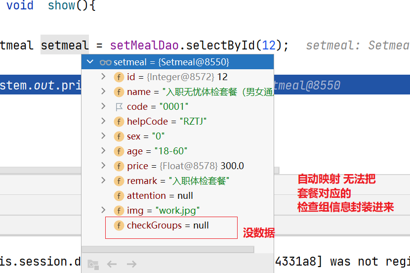
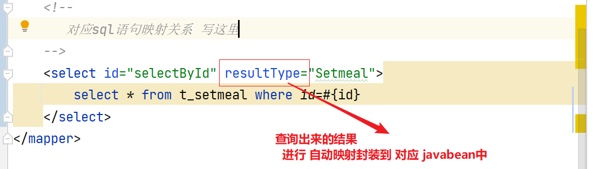
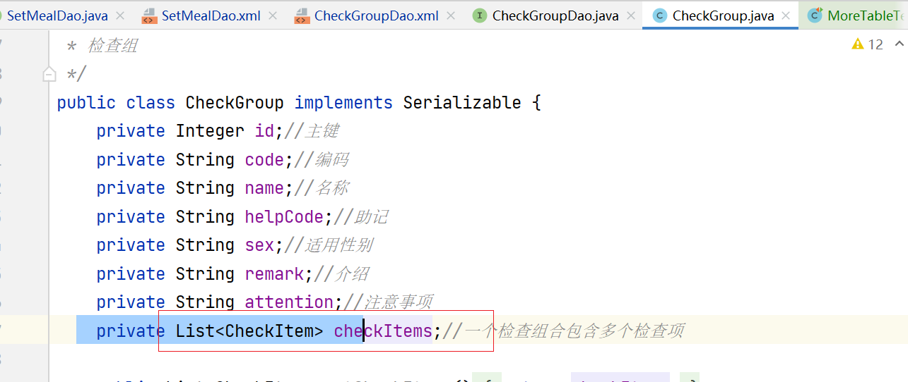
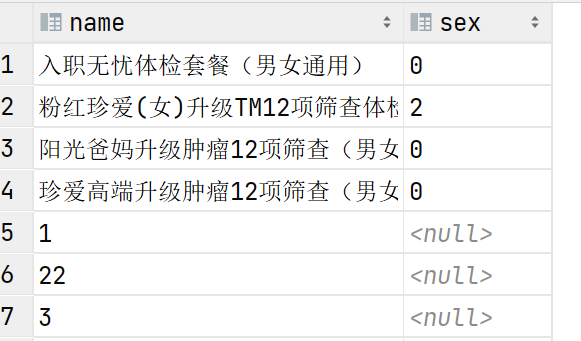
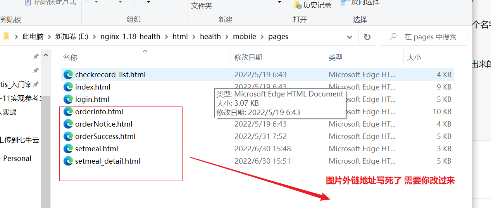

##  1:Mybatis中 关系查询    resultMap  

关系查询 从sql入手，能单表不多表。

~~~sql

# 业务 根据套餐id 查询 套餐的基本信息+多个检查组  每个检查组包含若干个检查项信息
# 根据套餐id 查询基本信息 12
select * from t_setmeal where id=12;
# 根据套餐信息 查询出来包含的检查组
#  一个套餐包含 多个检查组
#   检查组和套餐的关联信息在一张 中间表中
select tc.* from t_checkgroup tc
    join t_setmeal_checkgroup tsc on tc.id = tsc.checkgroup_id
      where tsc.setmeal_id=12;
# 子查询
# 根据 套餐id查询出来 关联的 检查组id们
select checkgroup_id from t_setmeal_checkgroup where setmeal_id=12;
# 根据查询的id 找到 对应的检查组数据
select * from t_checkgroup where id in (select checkgroup_id from t_setmeal_checkgroup where setmeal_id=12);

# 检查组id  包含的检查项怎么查询？
# 检查组 id 5 的所有的检查项信息
#因为查询的是 检查组对应的 检查项   对应关系--关联关系
#  再加一张关联关系表
select tc.* from t_checkitem tc
    join t_checkgroup_checkitem tcc on tc.id = tcc.checkitem_id
       where checkgroup_id=5;

~~~

把sql转换到 java代码中去实现！！！

~~~sql
select * from t_setmeal where id=12;
~~~

java中 对应JavaBean  pojo实体类

~~~java
/**
 * 体检套餐  跟表  t_setmeal对应
 */
public class Setmeal implements Serializable {
    private Integer id;
    private String name;
    private String code;
    private String helpCode;
    private String sex;//套餐适用性别：0不限 1男 2女
    private String age;//套餐适用年龄
    private Float price;//套餐价格
    private String remark;
    private String attention;
    private String img;//套餐对应图片存储路径
    private List<CheckGroup> checkGroups;//体检套餐对应的检查组，多对多关系
。。。。
~~~

java中选择的框架是 Mybatis  操作数据库的就是  dao层

(接口中有方法  xml必须实现对应sql  xml中有sql不一定有接口方法)

SetmealDao.java

~~~java
// 设计 根据id查询套餐基本信息的方法
Setmeal selectById(Integer id);
~~~

SetmealMapper.xml 

~~~xml
<!--
   对应sql语句映射关系 写这里
-->
<select id="selectById" resultType="Setmeal">
     select * from t_setmeal where id=#{id}    
</select>
~~~

测试：

~~~java
@SpringBootTest
@RunWith(SpringRunner.class)
public class MoreTableTest {
    @Autowired
    private SetMealDao setMealDao;

    @Test
    public void  show(){

        Setmeal setmeal = setMealDao.selectById(12);

        System.out.println(setmeal);
    }
}
~~~

发现 这个 sql只能查到 setmeal基本信息，这个一个套餐包含了多个检查组信息！！！！

Setmeal和检查组之间 有关系的 ，java中需要表达这种关系！！！！

~~~java
/**
 * 体检套餐  跟表  t_setmeal对应
 */
public class Setmeal implements Serializable {
     ....
    private List<CheckGroup> checkGroups;//体检套餐对应的检查组，多对多关系
    一个套餐 对应多个 检查组信息 
~~~

自动映射无法完成用什么完成呢？手动映射。

手动映射套路？

~~~xml
把 resultType属性  换成 resultMap属性 
map...映射的意思。
<resultMap>
  进行 表中字段和类中属性的 一对一的映射关系
</resultMap>

    <!--
       对应sql语句映射关系 写这里
    -->
    <select id="selectById" resultMap="setmealResultMap">
        select * from t_setmeal where id=#{id}
    </select>
<!--
      id 映射关系唯一标识
      type 把查询的数据 封装到 哪个对象中
-->
    <resultMap id="setmealResultMap" type="setmeal">
<!--
      <id column="id" property="id"/>
      id标签 是对表中主键 和 对象的某个属性产生映射关系
        查询到主键的值 复制给 setmeal对象中的id属性值
      <result column="name" property="name"/>
       查询到列叫name的值 复制给 setmeal对象中的name属性值
       如果 列名和 属性名一样的 用不着去写映射，会自动映射。
-->
<!--
     是想通过 mysql 能够把 该套餐对应的 多个检查组信息
       查询出来 存储到  setmeal对应的
            private List<CheckGroup> checkGroups;
                                  属性中
      得有一个sql 根据 套餐id查询所有的检查组信息
-->
<!--
  针对于 这种集合属性 怎么封装
       查询到的数据 收集到 一个集合中
           property 哪个集合呀？
           从哪查
          select="" 哪条sql能查出来
          column="" 你把哪一列的数据当成参数 传递给 这个sql
          id这一列 给下个sql的哪个参数
-->
       <collection property="checkGroups" select="selectBySetmealId" column="setmeal_id=id"/>
    </resultMap>

    <select id="selectBySetmealId"  resultType="CheckGroup">
        select tc.* from t_checkgroup tc
             join t_setmeal_checkgroup tsc on tc.id = tsc.checkgroup_id
        where tsc.setmeal_id=#{setmeal_id}
    </select>
~~~

拆分思想

因为  

~~~xml
    <select id="selectBySetmealId"  resultType="CheckGroup">
        select tc.* from t_checkgroup tc
             join t_setmeal_checkgroup tsc on tc.id = tsc.checkgroup_id
        where tsc.setmeal_id=#{setmeal_id}
    </select>
查询的是  t_checkgroup
按理说 应该写到  CheckGroupDao.xml 中

一旦拆出来 出来了 
  <collection 那边的 select上 id="包名+接口名.id">
      
        <collection property="checkGroups"
                   select="com.itheima.health.dao.CheckGroupDao.selectBySetmealId"
                   column="setmeal_id=id"/>
~~~

如何 完成 检查组里面 查询相关检查项

 CheckGroupDao.xml

~~~xml
    <select id="selectBySetmealId"  resultMap="checkGroupResultMap">
        select tc.* from t_checkgroup tc
                             join t_setmeal_checkgroup tsc on tc.id = tsc.checkgroup_id
        where tsc.setmeal_id=#{setmeal_id}
    </select>
<!--
  private List<CheckItem> checkItems;//一个检查组合包含多个检查项
-->
    <resultMap id="checkGroupResultMap" type="CheckGroup">
        <collection property="checkItems" select="selectByCheckGroupId" column="checkgroup_id=id"/>
    </resultMap>

    <select id="selectByCheckGroupId" resultType="checkItem">
        select tc.* from t_checkitem tc
                             join t_checkgroup_checkitem tcc on tc.id = tcc.checkitem_id
        where checkgroup_id=#{checkgroup_id}
    </select>
~~~

xml中 sql语句的id不能重复！！！！！！

再测试

## 2 map接收查询数据问题 

~~~sql
select name,sex from t_setmeal;
~~~

~~~java
List<Setmeal> select();
这就是用 pojo对象接收，要求pojo对象中有 name属性和sex属性。
  套餐名字
  遍历list 得到每个套餐对象 套餐对象.getName()获取了 某一个名字了
  
List<Map<String,Object>> select()
  这就是用map接收查询数据，键指的就是(列名)字段名，值就查询出来的每个内容
  每个map里面 是 有两对数据的 
      name : 套餐名
      sex:  0,1,2  
  遍历list 得到每个map  map.get("name") 获取套餐名        
           
~~~

## 3 任务7 前端图片展示问题 

## 任务16下载 需要注意的问题

this.getClass().getClassLoader().getResourceAsStream("report_template.xlsx");

这句话 读取 本地资源文件  

读完之后 当成一个 excel对象 

找到 sheet--cell 往单元格 设置数据 。。。

把 文件 写到 response.getOutputStram()

下载 识别的响应头
        response.setContentType("application/vnd.ms-excel");
        response.setHeader("content-Disposition", "attachment;fileName=" + reportDate + "_report.xlsx");

